[Previous Exercise](../2.0-send-var-with-curl) - [Next Exercise](../4.0-valide-playload-eda-zabbix)

#3.0 - Configure Event Drive to send Extra Variables to AAP.

Access the Gitlab "https://gitlab.lnx.example.local/":

Create a project:

Click on New Project

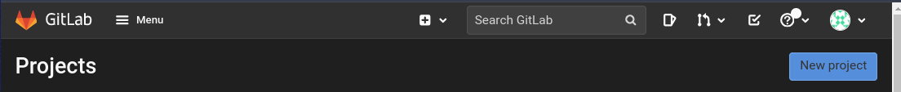

Click on Create blank project:


Nome: rh1-aap-extra-vars-eda 

Check box: "Initialize repository with a README"

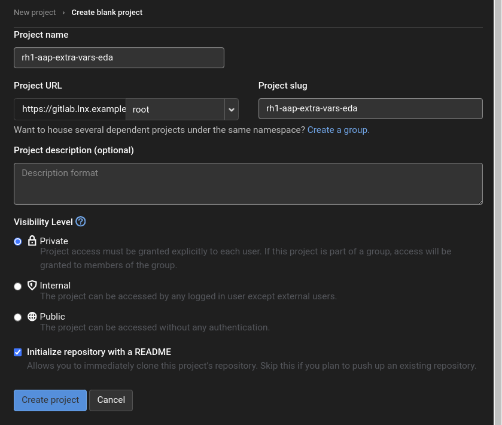


Let's clone the repository:

Select Clone:


Now in ssh:

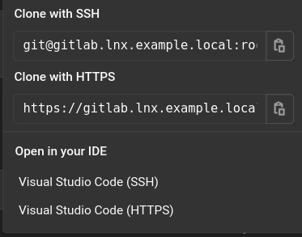

  ```bash
  git clone git@gitlab.lnx.example.local:root/rh1-aap-extra-vars-eda.git
  cd rh1-eda-example 
  cp -rf playbook rulebooks rh1-aap-extra-vars-eda/
  cd ../rh1-aap-extra-vars-eda/
  git add . 
  git commit -m "add folder playbook rulebooks "
  git push
  ```

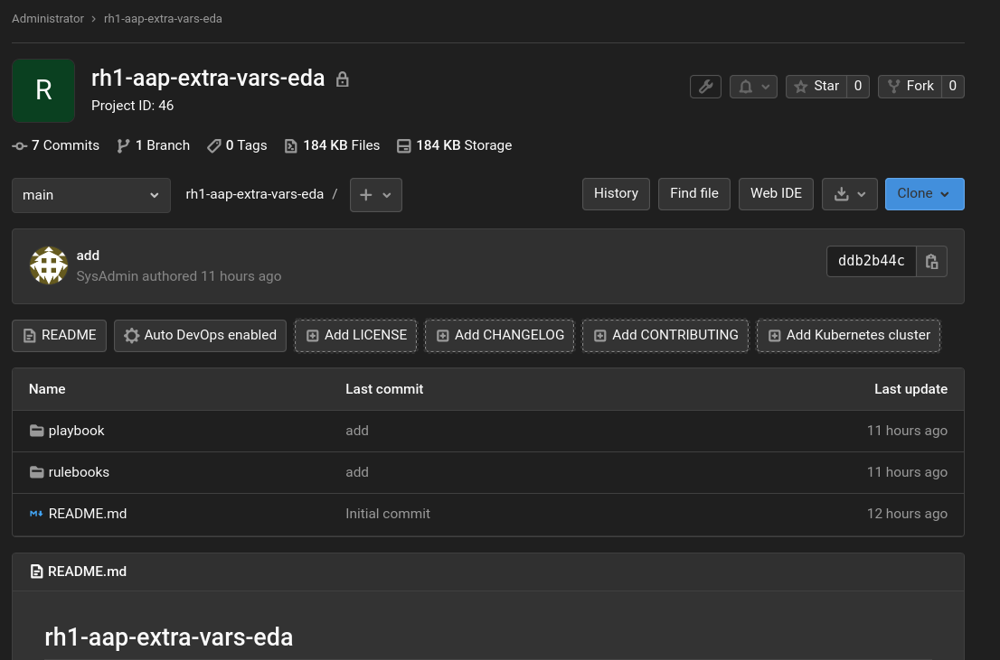


Validate both folders:

playbook
rulebooks

Create Personal Access Tokens:

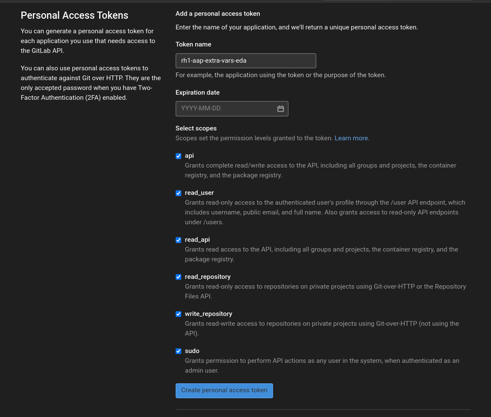
 

Create access to gitlab by id_rsa.pub of your bastion user.

Now on AAP:

Let's create the inventory:

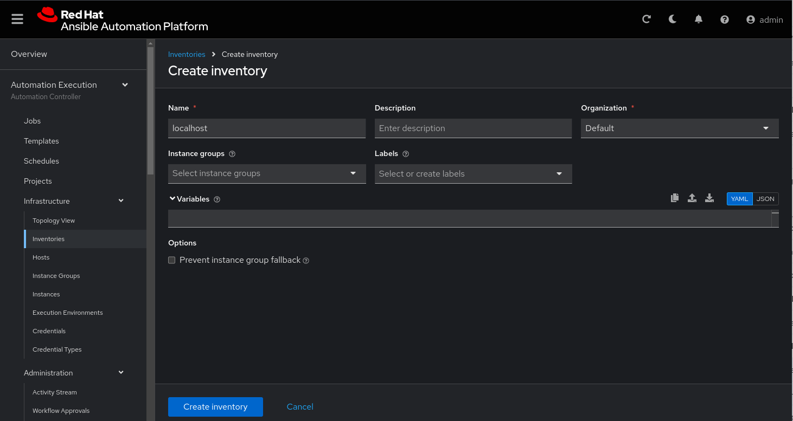

There is no need to have a host in the inventory:

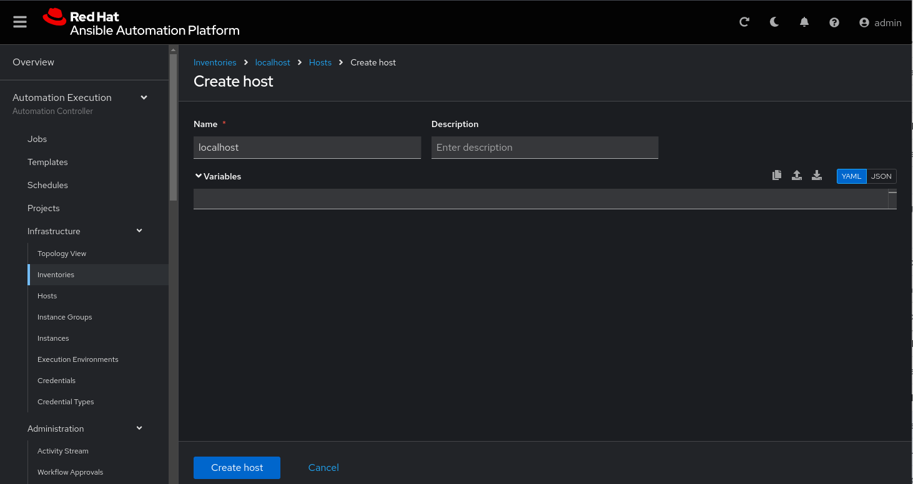


Disable host:

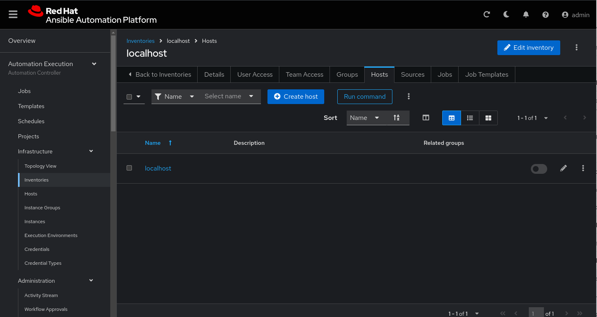


Let's create the hosts root user credential in AAP:

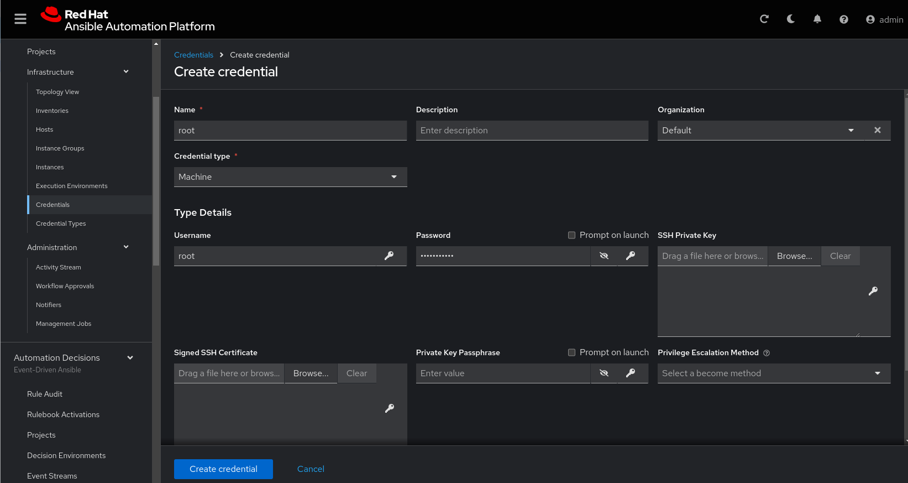

Let's create the gitlab credential to sync the rh1-aap-extra-vars-eda project:

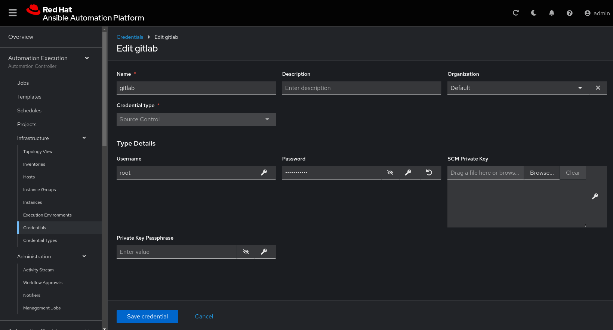

Let's create the project in AAP to sync the rh1-aap-extra-vars-eda project:

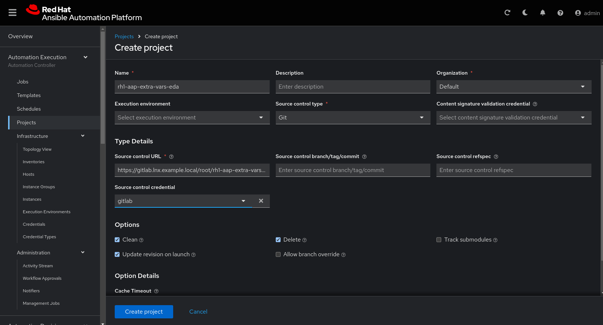

Valide o Last job status: Success

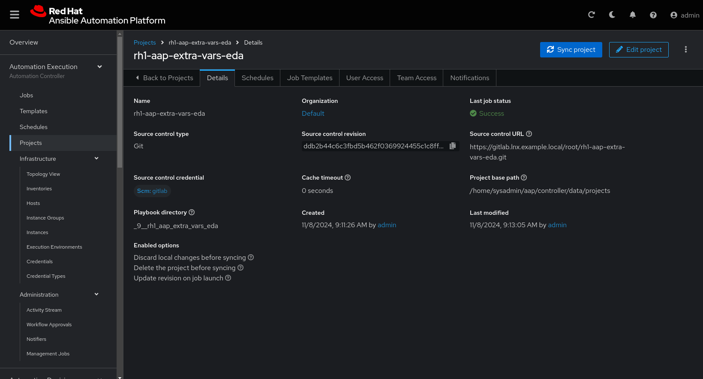

Let's create the job_template in AAP with the project name rh1-aap-extra-vars-eda:

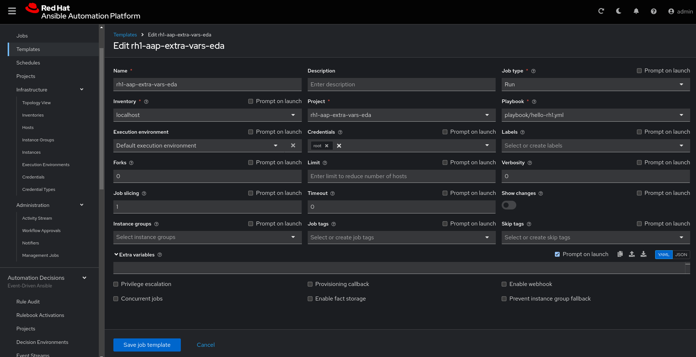

Now on Event Drive:


Now login in Event Drive: https://edacontrol001.lnx.example.local/.

Create the credential in EDA:

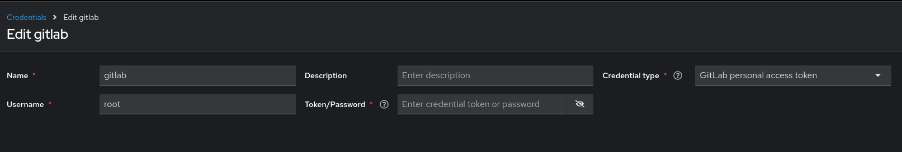


Create the project in eda:

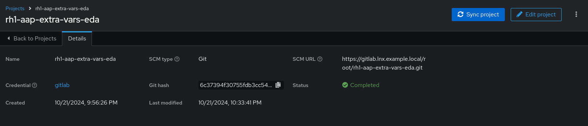


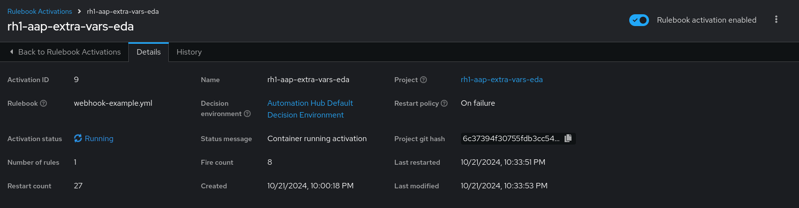

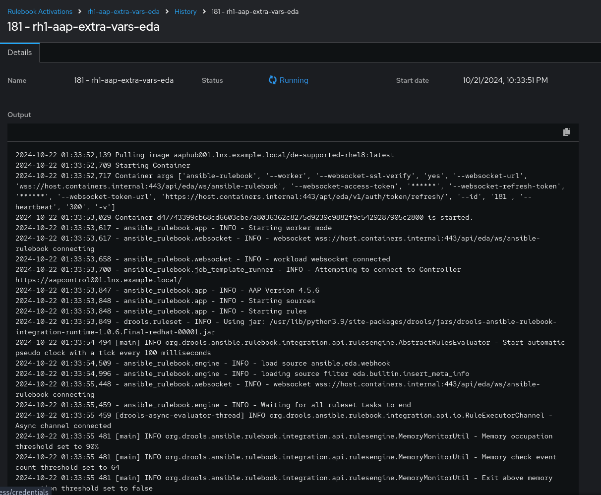


Send curl to Event Drive:

```bash
  curl -H 'Content-Type: application/json' -d '{"event_name": "Hello", "host_host": "gitlab.lnx.example.local" }' edacontrol001.lnx.example.local:5000/endpoint
```

In Event drive we will receive this message:

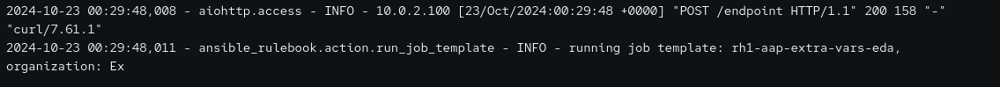

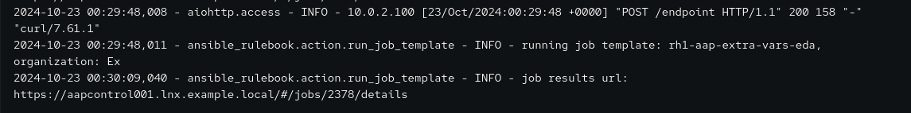

In aap we can see the job that was triggered:

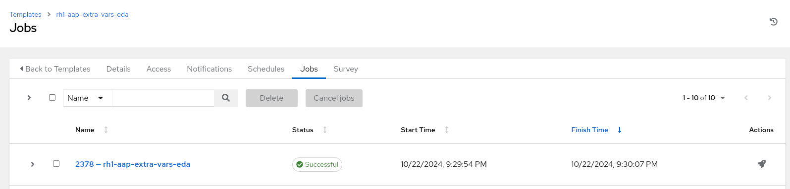


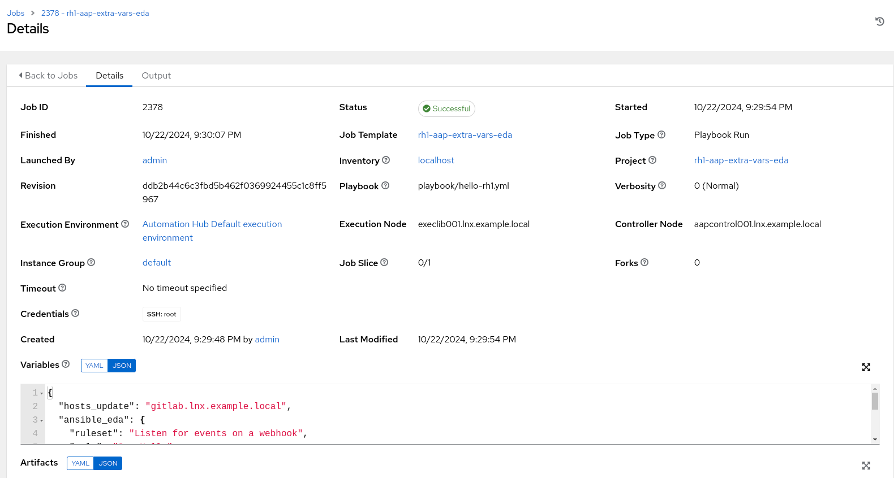


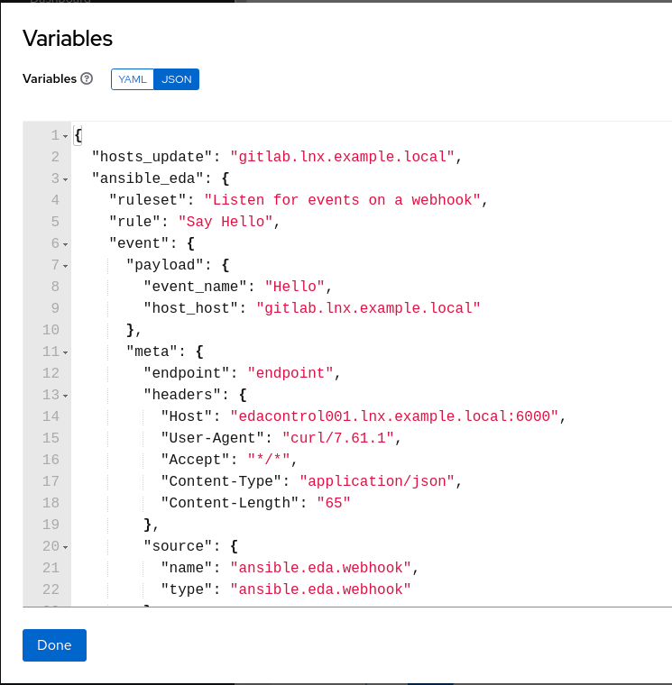


[Previous Exercise](../2.0-send-var-with-curl) - [Next Exercise](../4.0-valide-playload-eda-zabbix)