[Previous Exercise](../3.0-config-eda-send-extra-variables) - [Next Exercise](../5.0-valide-extra-vars)
#4.0 - Configure and Validate how the playload was sent to AAP

Let's run the client-zabbix playbook on the Ansible Automation Platform to configure the zabbix agent on the host apache001


Loging in zabbix http://srv-zabbix.lnx.example.local/. 
   User: Admin 
   Pass: zabbix 

Let's configure Zabbix to send events to Event Driven:

Alerts > Actions > Trigger actions:

Enable Report problems to Zabbix administrators:

Before:

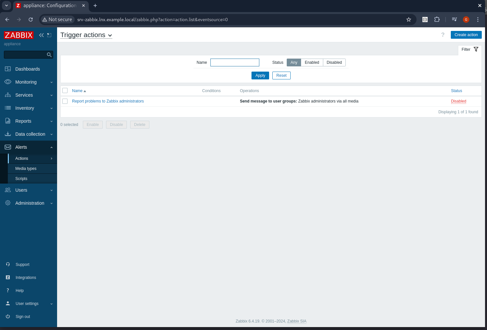

Clicking on the name disable:


Now let's configure the Event-Driven Ansible Media types:

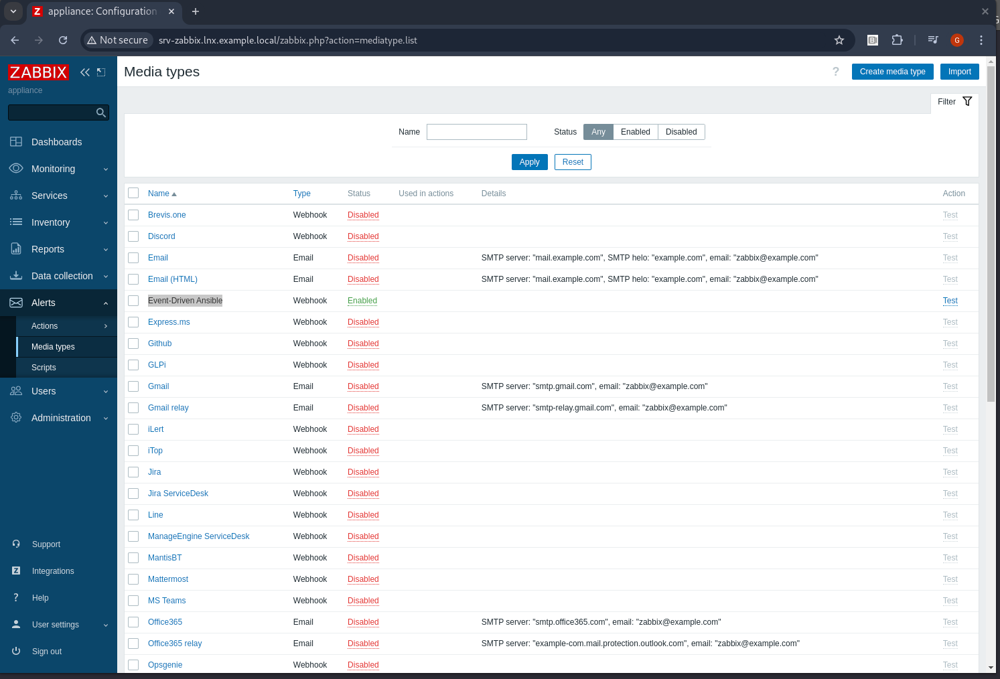


Let's configure the Admin user to send alerts to Event Driven:

Users > Users > Admin > Media > add:

Let's add the Event Driven IP and port to our rulebook


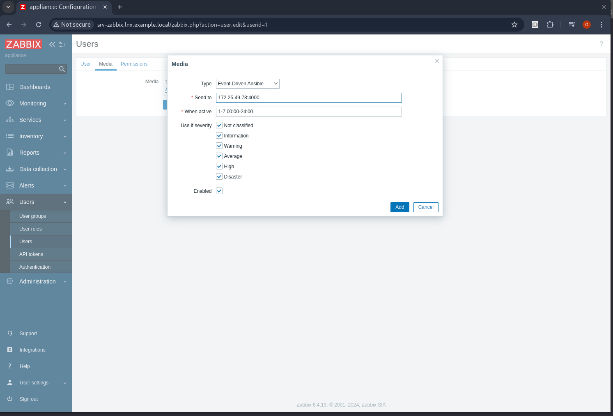


  ```bash
  172.25.49.78:7000
  ``` 

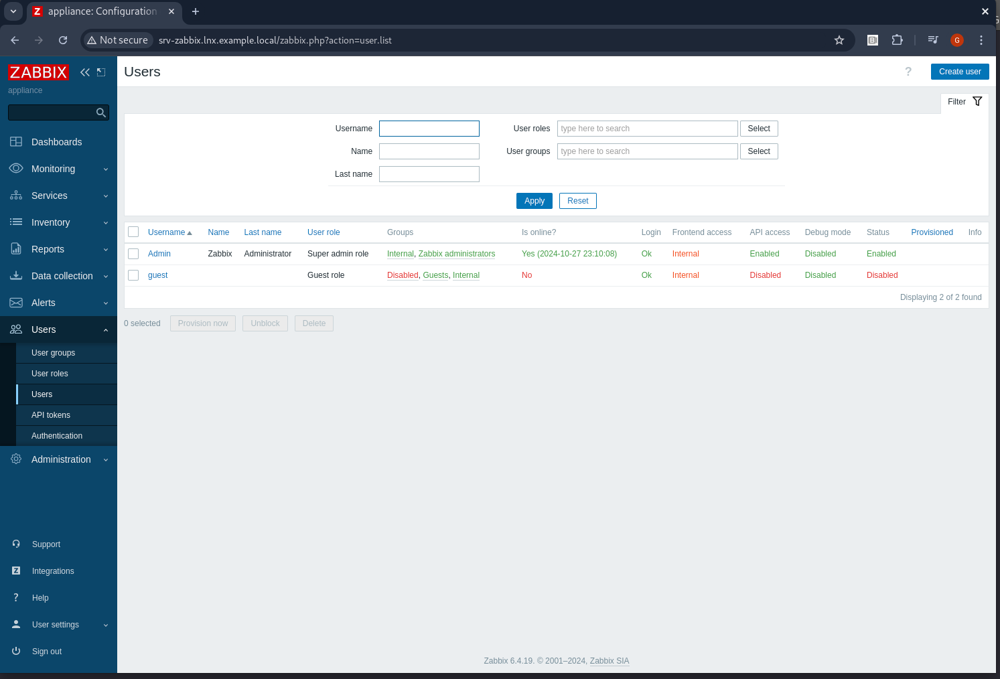

To save the changes. Click Update:

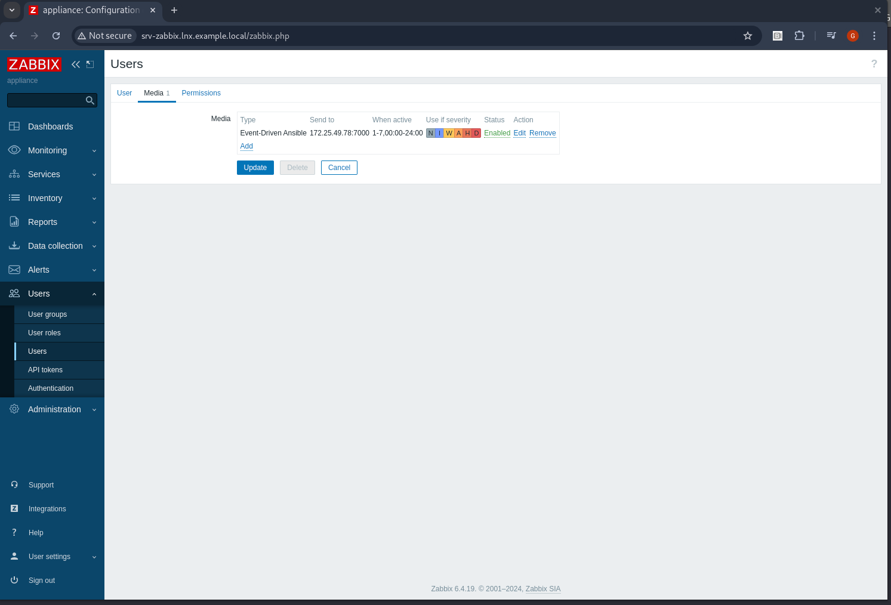


Let's log into GitLab and create a new repository. Call it eda-debug

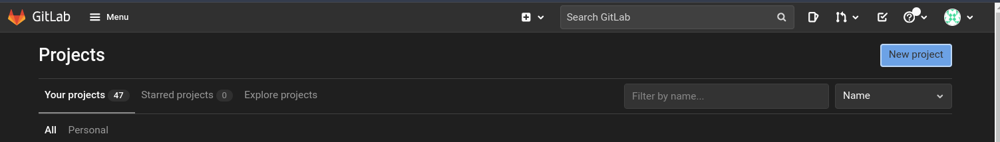

New Project > Create Blank Project:

 Project: name eda-debug


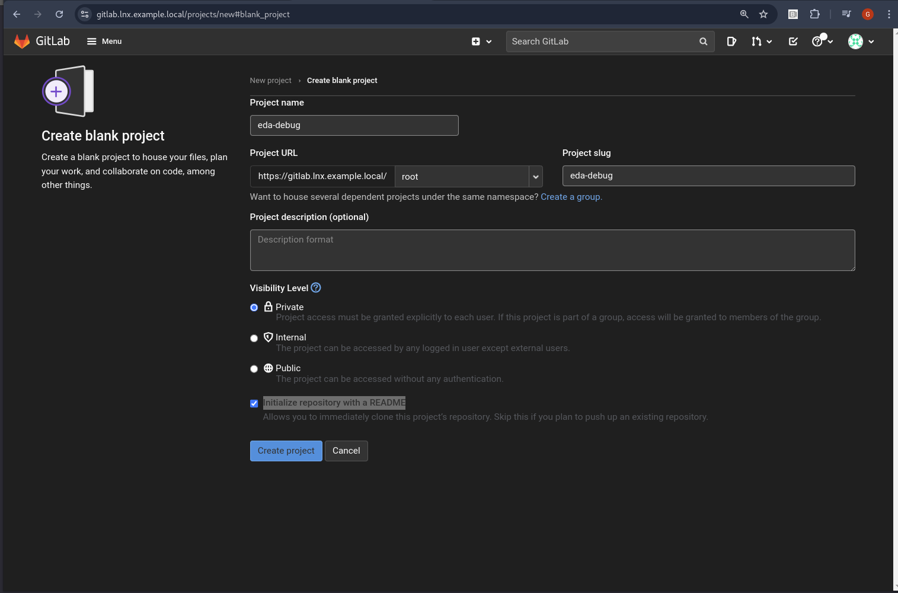


Let's log into the bastion and clone the repository at:

   
   ```bash
   git clone git@gitlab.lnx.example.local:root/eda-debug.git
   cd eda-debug
   mkdir rulebooks 
   touch webhook-debug.yml 
   ``` 

   ```yml
   ---
   - name: Listen for events on a webhook from Zabbix
     hosts: all
     sources:
       - name: Listen for alerts from Zabbix
         ansible.eda.webhook:
           host: 0.0.0.0
           port: 5000
   
     rules:
       - name: Output Zabbix Information
         condition: event.meta is defined
         action:
           debug:
   ```

Let's login EDA https://edacontrol001.lnx.example.local/overview

   ```bash
   username: admin
   password: redhat..123
   ``` 

Create the project with the name eda-debug:


   ```bash
   Name: eda-debug
   SCM URL: https://gitlab.lnx.example.local/root/eda-debug.git
   Credential: gitlab
   SCM Type: Git
   ``` 

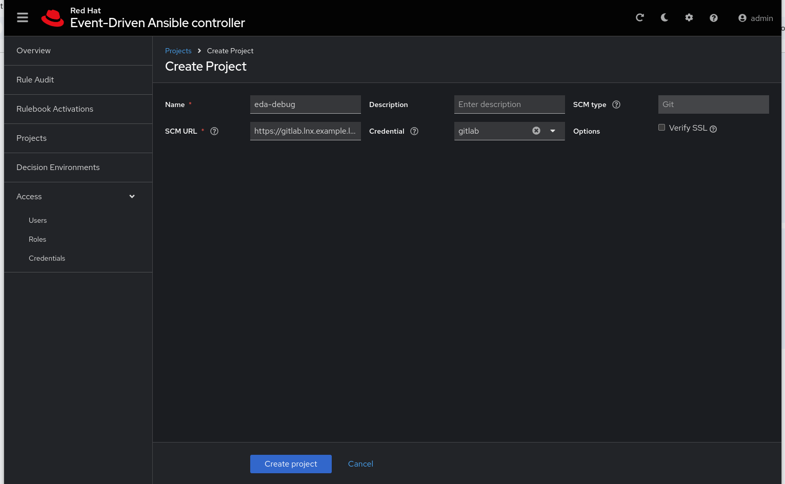

Criar a rulebook: 
   ```bash
   Name: eda-debug
   Project: eda-debug
   Rulebook: webhook-debug.yml
   Decision environment: Automation Hub Default Decision Environment
   ``` 

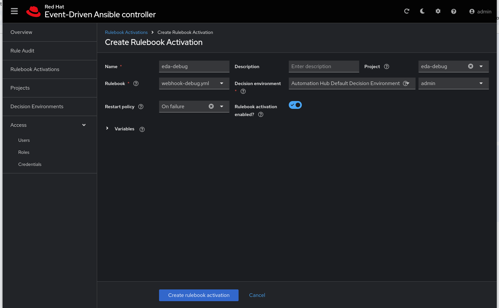

Let's validate the rulebook:

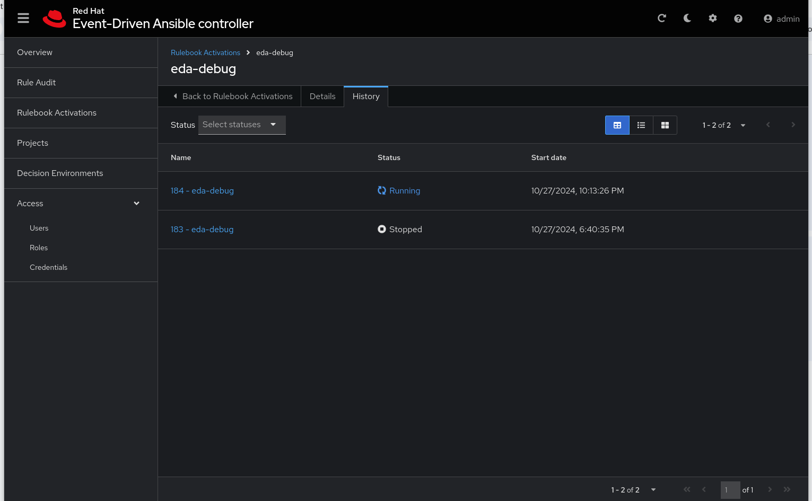

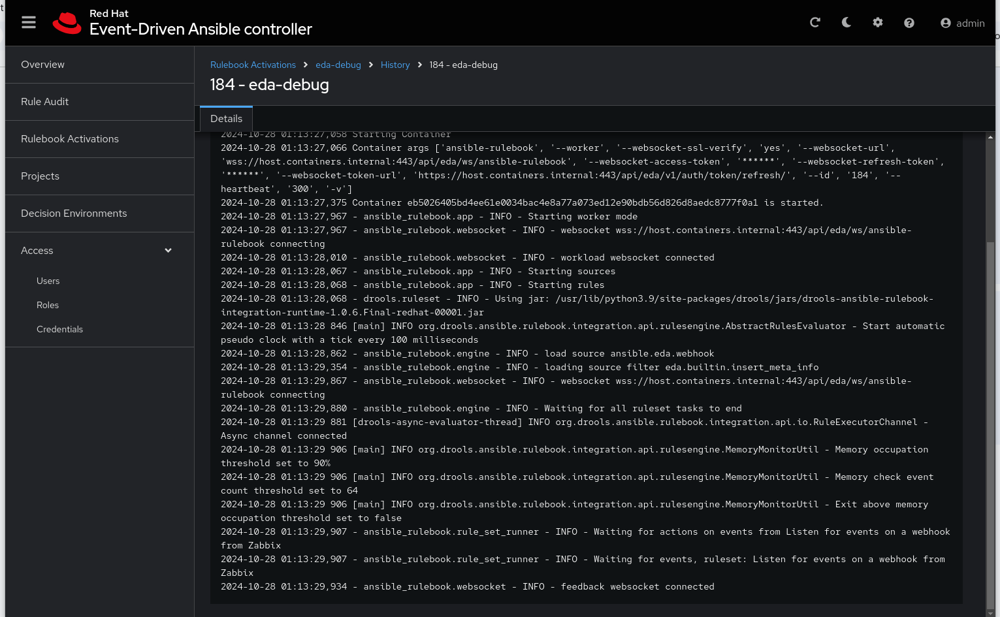

   ```bash
   curl -H 'Content-Type: application/json' -d '{"event_name": "Hello", "host_host": "gitlab.lnx.example.local" }' edacontrol001.lnx.example.local:7000/endpoint
   ``` 
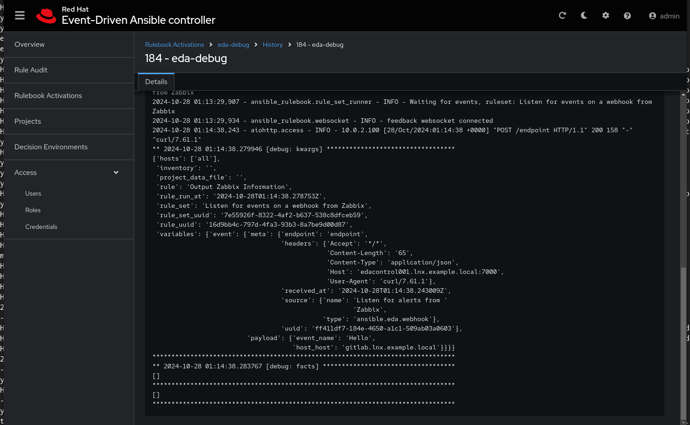


   ```bash
   ** 2024-10-28 01:14:38.279946 [debug: kwargs] **********************************
   {'hosts': ['all'],
    'inventory': '',
    'project_data_file': '',
    'rule': 'Output Zabbix Information',
    'rule_run_at': '2024-10-28T01:14:38.278753Z',
    'rule_set': 'Listen for events on a webhook from Zabbix',
    'rule_set_uuid': '7e55926f-8322-4af2-b637-538c8dfceb59',
    'rule_uuid': '16d9bb4c-797d-4fa3-93b3-8a7be9d00d87',
    'variables': {'event': {'meta': {'endpoint': 'endpoint',
                                     'headers': {'Accept': '*/*',
                                                 'Content-Length': '65',
                                                 'Content-Type': 'application/json',
                                                 'Host': 'edacontrol001.lnx.example.local:7000',
                                                 'User-Agent': 'curl/7.61.1'},
                                     'received_at': '2024-10-28T01:14:38.243009Z',
                                     'source': {'name': 'Listen for alerts from '
                                                        'Zabbix',
                                                'type': 'ansible.eda.webhook'},
                                     'uuid': 'ff411df7-184e-4650-a1c1-509ab03a0603'},
                            'payload': {'event_name': 'Hello',                      <<<<<<<<<<<<<<<<<<<<<<<<<<<<<<<<<<<<<<<<<
                                        'host_host': 'gitlab.lnx.example.local'}}}} <<<<<<<<<<<<<<<<<<<<<<<<<<<<<<<<<<<<<<<<<
   ********************************************************************************
   ** 2024-10-28 01:14:38.283767 [debug: facts] ***********************************
   []
   ********************************************************************************
   []
   ********************************************************************************
   ``` 


   ```bash
   ssh -l root root@apache003 
   systemctl stop httpd 

   ``` 

  ```bash
   2024-10-28 01:18:35,296 - aiohttp.access - INFO - 10.0.2.100 [28/Oct/2024:01:18:35 +0000] "POST /endpoint HTTP/1.1" 200 158 "-" "-"
** 2024-10-28 01:18:35.301806 [debug: kwargs] **********************************
{'hosts': ['all'],
 'inventory': '',
 'project_data_file': '',
 'rule': 'Output Zabbix Information',
 'rule_run_at': '2024-10-28T01:18:35.300708Z',
 'rule_set': 'Listen for events on a webhook from Zabbix',
 'rule_set_uuid': '7e55926f-8322-4af2-b637-538c8dfceb59',
 'rule_uuid': '16d9bb4c-797d-4fa3-93b3-8a7be9d00d87',
 'variables': {'event': {'meta': {'endpoint': 'endpoint',
                                  'headers': {'Accept': '*/*',
                                              'Accept-Encoding': 'deflate, '
                                                                 'gzip, br',
                                              'Content-Length': '882',
                                              'Content-Type': 'application/json',
                                              'Host': '172.25.49.78:7000'},
                                  'received_at': '2024-10-28T01:18:35.296372Z',
                                  'source': {'name': 'Listen for alerts from '
                                                     'Zabbix',
                                             'type': 'ansible.eda.webhook'},
                                  'uuid': 'a7ace5c3-4165-41fc-9bb7-c4290e38d613'},
                         'payload': {'HTTPProxy': '',
                                     'acknowledged': 'No',
                                     'endpoint': '/endpoint',
                                     'event_date': '2024.10.28',
                                     'event_datetime_timestamp': 1730078312,
                                     'event_id': 862,
                                     'event_name': 'Apache: Service is down',
                                     'event_nseverity': 3,
                                     'event_object': 0,
                                     'event_severity': 'Average',
                                     'event_source': 0,
                                     'event_tags': {'class': ['software'],
                                                    'component': ['application',
                                                                  'health',
                                                                  'system'],
                                                    'scope': ['availability'],
                                                    'target': ['apache']},
                                     'event_time': '01:18:32',
                                     'event_value': 1,
                                     'host_groups': ['Applications',
                                                     'Databases',
                                                     'Linux servers',
                                                     'Virtual machines'],
                                     'host_host': 'apache003.lnx.example.local',
                                     'host_id': 10633,
                                     'host_ip': '172.25.101.3',
                                     'host_port': '10050',
                                     'monitoring_source': 'Zabbix sever',
                                     'operation_data': 'Down (0), 0',
                                     'send_to': '172.25.49.78:7000',
                                     'subject': 'Event ID: 862, Host: '
                                                'apache003.lnx.example.local, '
                                                'Problem: Apache: Service is '
                                                'down',
                                     'trigger_description': '',
                                     'trigger_id': 23919,
                                     'trigger_name': 'Apache: Service is '
                                                     'down'}}}}
  ```


AAP Job Details:

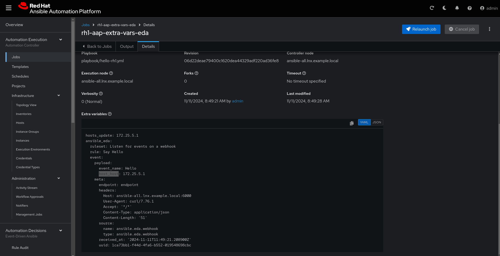


[Previous Exercise](../3.0-config-eda-send-extra-variables) - [Next Exercise](../5.0-valide-extra-vars)